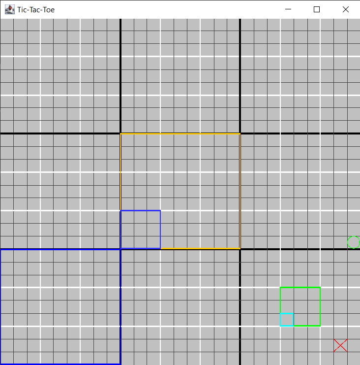
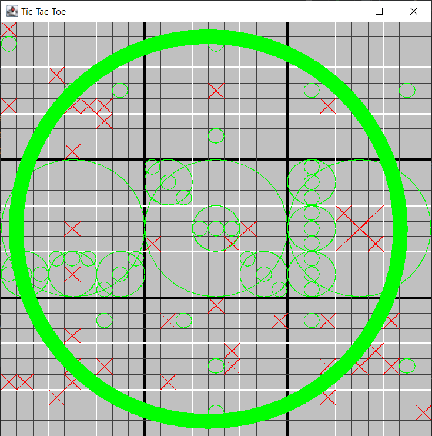

# Tic-Tac-Toe^3

_Wait. What?_

That's right. The rules are simple. The game is not. Based on [two-level tic-tac-toe](https://en.wikipedia.org/wiki/Ultimate_tic-tac-toe) ("Ultimate Tic-Tac-Toe"), this takes it an unnecessary step further.

## The Rules

### Placing X's and O's

Similar to two-level tic-tac-toe ("Ultimate Tic-Tac-Toe"), placable locations are limited by the locations of the previously placed tiles.

We can call the different sub-boards/positions the **outer** (nine on the board), **middle** (27 on the board), and **inner** (smallest tiles).

On a player's turn, they may place in the middle-level board cooresponding to the previously placed piece's inner tile, in the outer-level board cooresponding to the previously placed piece's middle tile.

As you can see in the above image, the first piece placed was the X in the `lower-right, lower-right, center`. This cooresponds to the mid-level green box in the `lower-right, center` which is where the O player may place their tile. This means the next X piece will be placed somewhere in the yellow outer-level `center` board.

If the player were to place their piece in the cyan tile, the blue boards (middle-level `middle, lower-left` and outer-level `lower-left`) show where the next two turns will be limited to.

In the event the placable board has already been won or completely filled (a tie), a player may place their piece anywhere. This introduces new opportunities and strategic challenges.

Sometimes, the best way to learn is to try it. Try running the game and watching how placement affects the next moves, you can quickly get the hang of it!

### How to Win

Similar to two-level tic-tac-toe, the goal is to win sub-boards in the same manner as normal tic-tac-toe. Victory is achieved by winning three-in-a-row outer-level boards. To win these boards, the player must win three-in-a-row middle-level boards, which can be won in the same manner as a normal game of tic-tac-toe.

In the below example, the O player has managed to win the game by winning the `center-left`, `center`, and `center-right` outer-level boards, each by winning three-in-a-row of the mid-level boards.

## Installation

[**Click Here**](https://github.com/2kai2kai2/tictactoe-3/releases/latest) to go to the latest release page.

